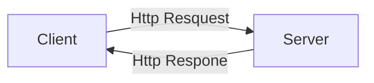

# Task

Tìm hiểu về Golang & HTTP Request/Response 

**Keyword**

Client-Server, Web Development, Request / Response

## Golang 

1. syntax basic 
2. variables
3. function
4. for if else 
5. struct, slices , map
6. pointer 

## HTTP Request/Response 

Mô hình của ứng dụng web ( web application)
Mô hình client-server

1. Client
Là người dùng/ browser  , là các thiết bị khác máy chủ đóng vai trò gửi yêu cầu đến server . Mỗi lần gửi yêu cầu qua giao thức Http . 
Http bao gồm : URL , status , và tập html, css, javascrip
2.Server là máy chủ , lưu trữ dữ liệu, cài đặt các webservice thực hiện các yêu cầu request từ phía client và trả về response thông qua giao thức http reques. 

Khi vào một trang web bất kỳ. Sau khi chúng ta nhập tên miền "Google.com"và ấn enter . Thì tên  "Google.com" gửi truy vấn qua Resolving Name Server(RNS) . Nếu RNS không biết địa chỉ IP của tên miền đó thì RNS sẽ tìm trên ROOT SERVER để tìm các tên miền đuôi .VN hoặc .com. Sau đó RNS sẽ gửi yêu cầu qua Top Level để biết được tên  "Google.com" đang được lưu ở vị trị nào . Và RNS sẽ dùng địa chỉ IP đó để hỏi Authority Name Server sẽ biết được địa chỉ IP chính xác của tên miền mình cần và gửi lại địa chỉ IP là webserver của ""Google.com" . Sau đó RNS sẽ ghi nhớ lại địa chỉ IP của  "Google.com" để lần sau , khi người dùng gửi request đến RNS thì RNS có thể tìm ra ngay địa chỉ IP của  "Google.com" 

Tiếp theo sau khi có địa chỉ của webserver mỗi lần chúng ta thực hiện các sự kiện trên web đó thì sẽ theo mô hình client - server . 
Tức là khi đó ta gửi 1 request đến server theo phương thức HTTP có định dạng :
1. Method (GET, UPDATE, DELETE, POST) 
2. URL 
3. HTTP version
4. Cookie , session...

Khi server nhận được request , thì bên phía server sẽ thực hiện request đó ( thực hiện tính toán hoặc truy xuất tới database)  và sau đó sẽ trả về 1 response : 
1. status code (200 - thành công , 404 not found ... ) 
2.  HTTP-version
3. tệp html 
4. các thông báo chi tiết 
 
Sau khi nhận được response , webserver sẽ tự đông render tệp html , css, js ra trang web ta nhìn thấy có thể nhìn thấy . 

And this will produce a flow chart:

## Web development
Website vận hành : 
Khi một yêu cầu gửi đến webserver thì nó sẽ tìm thấy nội dung đó. Nếu nó tồn tại, máy chủ sẽ gửi trả lời lại cho client/browser.
Khi nhận phản hồi, trình duyệt web sẽ phân tích và thực hiện nội dung phản hồi đó. Nội dung ấy sẽ hiển thị trên trang web để người dùng cuối nhìn thấy.

### Website tĩnh
Là website chỉ có những chức năng hiển thị bằng html , css và javascrip . Nó có nhiệm vụ đăng tải các thông tin giống như một tờ báo và chúng không có các cơ sở dữ liệu đằng sau để lưu trữ và truy xuất (Frontend)

### Website động
Là website được thiết kế hoàn chỉnh có các cơ sở dữ liệu để ta có thể dễ dàng truy xuất . Chúng ta có thể thay đổi và quản lý các user ( Backend+ Frontend)

### Backend-Frontend
Frontend - Sử dụng html , css , js để thiết kế giao diện ( UX/UI ) , ngoài ra sử dụng các framework để tương tác với người dùng , làm các sự kiện của người dùng trở nên dễ dàng. 

Backend - là những công việc đằng sau của 1 trang web , tất cả những hoạt động không được nhìn thấy trên trình duyệt, thiết kế những cấu trúc cốt lõi của website như tính logic , thiết kế database , tối ưu các request từ phía client gửi về ...

Frontend thì sẽ thường làm việc bên Client , Còn backend làm việc với server . 2 công việc này máy tính tương tác với nhau qua API ( application programming interface) . Khi có 1 request gửi về server , bên phía backend sẽ nhận request đó và tính toán rồi bắn lại các api để từ đó frontend đón các api đó để hiển thị cho người dùng . 

## Liên quan
1. API - RESTfull API- WEB API , JSON
	API là  Web API  là một phương thức dùng để cho phép các ứng dụng khác nhau có thể giao tiếp, trao đổi dữ liệu qua lại. Dữ liệu được Web API trả lại thường ở dạng  JSON hoặc XML thông qua giao thức HTTP hoặc HTTPS.
	RESTfulAPI là chuẩn dùng trong việc thiết kế API cho các webservices . để các ứng dụng web có thể giao tiếp với nhau. 
	
2. Kiến trúc microservice & Monolithic
	a. Monolithic
	Chỉ phát triển, triển khai và quản lý của một khối duy nhất. Bao gồm cơ sở dữ liệu , giao diện phía client , ứng dụng phía server . tất cả các phần mềm được gộp là và các chức năng đc quản lý tại 1 nơi . 
	b. Microservice
	Là chia thành từng phần riêng biệt rồi tổng hợp của nhiều services nhỏ và độc lập có thể chạy riêng biệt, phát triển và triển khai độc lập, từng nghiệp vụ khác nhau . Và mỗi 1 services sẽ giao tiếp với nhau qua API . vì vậy có thể làm độc lập và có thể dùng công nghệ riêng biệt không liên quan đến nhau. 
4. Mô hình MVC
	Là mô hình model view controller
	Trong đó mỗi packet có thêm chức năng riêng . View là để tương tác với người dùng , Xử lý các dữ liệu của người dùng nhập vào hay yêu cầu là controller . Model 
có chức năng là tương tác với cơ sở dữ liệu . 
 
